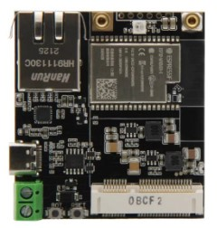
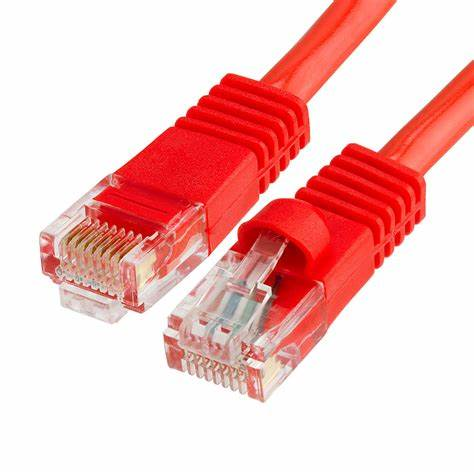
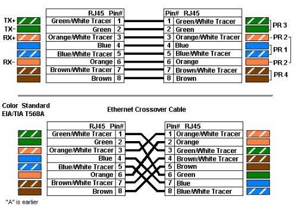

| Supported Targets | ESP32 | ESP32-C2 | ESP32-C3 | ESP32-C6 | ESP32-H2 | ESP32-S2 | ESP32-S3 |
| ----------------- | ----- | -------- | -------- | -------- | -------- | -------- | -------- |

### Descripción del Proyecto.

### Requisitos Previos.

Para el desarrollo de este proyecto se requiere de forma previa la disposicion de componentes fisicos especificamente el dispositivo LilyGO T-Internet-COM con un microcontrolador de la serie ESP32 Wrover-E.




Se recomienda obtener un cable de conexion Ethernet configurado en Ethernet direct y que ademas cumpla con una especificacion CAT 7 la cual permite la conexion de dispositivos de alta velocidad con dispositivos de baja velocidad.



Ademas es importante tener instalado de forma previa el entorno de desarrollo de software Visual Studio Code y posteriormente instalar el framework ESP-IDF como una extension de Visual Studio Code.

## Configuración del Entorno de Desarrollo.

Instrucciones para la configuracion del entorno en un framework ESP-IDF para la integracion compatibilizada de funciones para microcontroladores de la serie Wrover-E adecuadndo la recepcion de telemetria mediante protocolos IoT y el aprovsionamiento de data mediante un cliente mqtt con transporte TLS mediante el puerto 8884, en Azure IoT Central.

### CREAR LIBRERIAS AZURE EN ESP_IDF

Para crear las librerias como componentes externos de azure inicialmente se dispone la creacion de un nuevo directorio o carpeta dentro del proyecto, denominada components, luego de crear este nuevo directorio lo que haremos sera dirigirno hacia el archivo CMakeLists.txt ubicado en la zona global del proyecto, y alli incluiremos el nuevo directorio creado "components", escribiendo dentro del CMakeLists el siguiente comando "list(APPEND EXTRA_COMPONENT_DIRS components)" y asi guardamos el cambio mediante el comando CTRL+S, luego procedemos a la creacion de cada uno de los componentes necesarios para crear un cliente mqtt en el esp32 que permita habilitar una conexion a Azure IoT Central en una aplicacion IoT.

### CREACION DE COMPONENTES DENTRO DE LA CARPETA "COMPONENTS"

Dirigirse al terminal de esp-idf y escribir el siguiente comando en el terminal "cd components" para ubicarse dentro del directorio incluido en el CMakelists.txt global, luego de ello en el mismo terminal escriba el siguiente comando "idf.py create-component nombre_del_componente", posterior a esta accion se creara una carpeta con el nombre del componente dentro del directorio "components", la carpeta creada recientemente con el nombre del componente contiene una subcarpeta denominada "include" la cual contiene el header de nuestro componente o en este caso de ejemplo nombre_del_componente.h, luego encontramos un archivo denominado nombre_del_componente.c.

### ERROR A LA HORA DE INCLUIR COMPONENTES EXTERNOS O RECIEN CREADOS EN EL ARCHIVO PRINCIPAL.

Luego de haber creado nuestro primer componente lo natural sera tratar de incluir como una libreria desde el archivo "app_main.c" el componente que creamos de la siguiente forma "#include nombre_del_componente.h", lo cual cuando construimos el proyecto nos genera un error; si revisamos detenidamente nuestro componente puede estar solicitando librerias internas de esp-idf u solicitando otro componente creado en la libreria del componente que deseamos usar en el main, para solucionar este error debemos establecer el requerimento dentro del archivo CMakelists.txt del propio componente escriibiendo el siguiente comando <-REQUIRES "az_result"-> (copiar sin los guiones y signos de mayor-menor)
luego de esto se guarda el cambio y se debe dar clic a la opcion ESP-IDF FULL CLEAN cada vez que actualizamos el CMakelists.txt en cada componente y se contruye nuevamente lo que permite al ninja.build contruir sin conflictos el proyecto.

### LIBRERIAS DE AZURE_IOT_CENTRAL.

En este codigo se contruyen los componentes necesarios para desarrollar un cliente mqtt que se aprovisiona a Azure IoT central es importante resaltar que cada una de las librerias son escenciales para la creacion de una plantilla o "Azure_PnP_Template" el cual es un modelo que permite desarrollar aplicaciones IoT de forma rapida y sencilla en el lenguaje de C.

### DESCRIPCION DE CODIGO DE APROVISIONAMIENTO INTEGRANDO MQTT + AZURE + ESP_NOW
Inicialmente se incluyen todas la librerias necesarias para usar los recursos de azure como componentes esp-idf

//...

##### #include "esp_now.h" ---> Para recibir informacion de un nodo ESP_NOW

//....

##### #include "protocol_examples_common.h"

//...

##### #include "esp_log.h"
##### #include "mqtt_client.h"
##### #include "time.h"

//....
##### #include "Azure_IoT.h" ---> Archivos para la implementacion de plantillas para una aplicacion IoT Central P&P.
##### #include "Azure_IoT_PnP_Template.h"
##### #include "iot_configs.h"
##### #include "az_core.h"
##### #include "az_iot.h"
##### #include "azure_ca.h"
//.....

##### #include "mbedtls/base64.h" -----> Librerias para gestionar la seguridad de conexion TLS base64 


Este es el manejador de eventos mqtt que usaremos del framework para el envio de datos a Azure IoT central.
##### static void mqtt_event_handler(void *handler_args, esp_event_base_t base, int32_t event_id, void *event_data)>

## Creacion de un cliente MQTT que permita transportar telemetria a Azure.

Para establecer la funcion static int mqtt_client_init_function(mqtt_client_config_t *mqtt_client_config,  mqtt_client_handle_t *mqtt_client_handle) de forma funcional y llamar en cada Switch del manejador de eventos; 

#### 1) Se deben declarar como estructura las credenciales para el transporte MQTT y generar los payloads correspondientes. 

#### 2) Para ello se deben instanciar variables de forma inicial como estructuras.

#### 3) Definir como punteros AZ_SPAN (los cuales se deben redifinir #define AZ_IOT_DATA_BUFFER_SIZE), esto permite usar la posicion de memoria flotante optimizando el rendimiento de codigo. 

## ESTRUCTURAS:

>##### struct authentication_t ------> Para usar todas las credenciales de password
>##### struct session_t -------> Para usar estructuras que permiten verificar el estado de session mqtt
>##### struct network_t -------> Para verficar el estado de conexion.
>##### struct credentials_t --------> Para usar estructuras que permiten usar como un puntero AZ_SPAN como username.
>##### esp_http_client_config_t mqtt_cnfi; ------> Para usar estructuras que permiten validar certificaciones pem.
>##### struct json_n mqtt_cfi; -------> Un puntero a un contexto proporcionado por el usuario que se utiliza en conjunto con la función allocator_callback. Puede contener información adicional proporcionada por el usuario.

La estructura <az_json_writer> es parte de una biblioteca de escritura de JSON. Esta estructura se utiliza para llevar un seguimiento del estado y los detalles de la escritura de datos JSON en una secuencia de bytes o en un búfer de destino.

## Ejemplo de Salida en el monitor serial.

```
I (3714) event: sta ip: 192.168.0.139, mask: 255.255.255.0, gw: 192.168.0.2
I (3714) system_api: Base MAC address is not set, read default base MAC address from BLK0 of EFUSE
I (3964) MQTT_CLIENT: Sending MQTT CONNECT message, type: 1, id: 0000
I (4164) MQTT_EXAMPLE: MQTT_EVENT_CONNECTED
I (4174) MQTT_EXAMPLE: sent publish successful, msg_id=41464
I (4174) MQTT_EXAMPLE: sent subscribe successful, msg_id=17886
I (4174) MQTT_EXAMPLE: sent subscribe successful, msg_id=42970
I (4184) MQTT_EXAMPLE: sent unsubscribe successful, msg_id=50241
I (4314) MQTT_EXAMPLE: MQTT_EVENT_PUBLISHED, msg_id=41464
I (4484) MQTT_EXAMPLE: MQTT_EVENT_SUBSCRIBED, msg_id=17886
I (4484) MQTT_EXAMPLE: sent publish successful, msg_id=0
I (4684) MQTT_EXAMPLE: MQTT_EVENT_SUBSCRIBED, msg_id=42970
I (4684) MQTT_EXAMPLE: sent publish successful, msg_id=0
I (4884) MQTT_CLIENT: deliver_publish, message_length_read=19, message_length=19
I (4884) MQTT_EXAMPLE: MQTT_EVENT_DATA
TOPIC=/topic/qos0
DATA=data
I (5194) MQTT_CLIENT: deliver_publish, message_length_read=19, message_length=19
I (5194) MQTT_EXAMPLE: MQTT_EVENT_DATA
TOPIC=/topic/qos0
DATA=data
```


## DESARROLLO DE APROVISIONAMIENTO AZURE.
### (PRUEBA DE ESTADO DE TRANSMISIÓN ETHERNET)

<h1 align = "center">LilyGo T-Internet-COM</h1>

En este proyecto se usa para el aprovisionamiento de data a Azure IoT Central mediante un dispositivo Espressif con referencia de microcontrolador ESP_WROVER E fabricado por LilyGo, el cual esta dotado de capacidades para el procesamiento de conexiones Ethernet mediante la conexion interna de un PHY definido, ademas :

#### Diagrama de dispositivo LilyGO T-Internet


## Caracteristicas tecnicas.

#### Conectividad: 
El dispositivo suministra información a la nube mediante una red LAN a través de un puerto de conexión Ethernet
#### Actualización del Firmware: 
UART descarga/OTA (a través de la red/host para descargar y escribir firmware)
#### Tipo de cifrado: 
AES/RSA/ECC/SHA
#### Mecanismo de seguridad: 
WPA/WPA2/WPA2-Enterprise/WPS
#### Protocolo de red: 
IPv4, IPv6, SSL, TCP/UDP/HTTP/FTP/MQTT
#### Desarrollo de Software: 
Admite desarrollo de servidores en la nube/SDK para el desarrollo de firmware de usuario
#### Configuración de usuario: 
Conjunto de instrucciones AT +, servidor en la nube, android/iOS app
#### Estándar: 
FCC/CE-RED/IC/TELEC/KCC/SRRC/NCC (esp32 chip)
#### Velocidad: 
802.11 b/g/n (802.11n, velocidad de hasta 150mbps) A-MPDU y polimerización de A-MSDU, soporte 
#### INTERVALO DE PROTECCIÓN DE: 
0,4μs
#### Rango de frecuencia: 
2.4 GHz ~ 2.5GHz (2400 M ~ 2483,5M)
#### Potencia de transmisión: 
22dBm
#### Distancia de comunicación: 
300m

#### HALF_DUPLEX o FULL_DUPELX.




